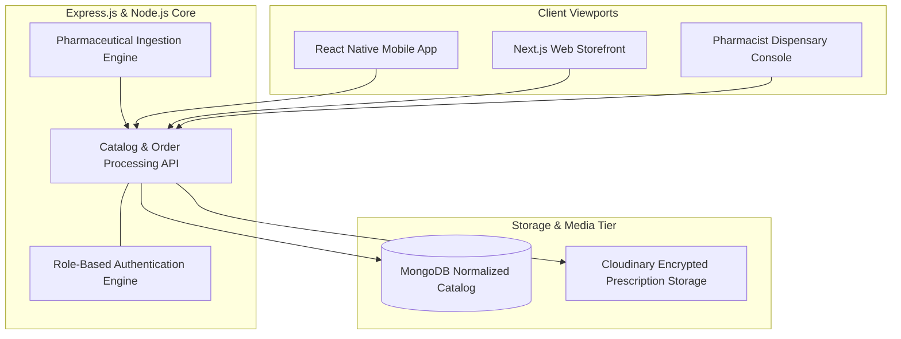

# Health Hands Pharmacy — Digital Prescription & Retail Platform

Systems architecture and engineering case study for an integrated multi-tier pharmaceutical retail, prescription validation, and automated dispensary platform engineered for **Health Hands Pharmacy**.

---

## Role & Individual Ownership

* **Role:** Full-Stack Healthcare Systems Developer
* **Context:** Engineered under Softsols Pakistan in collaboration with licensed clinical pharmacists.
* **Scope of Ownership:** Co-engineered the 4-tier application ecosystem, engineered the pharmaceutical catalog ingestion engine, built the prescription verification audit queue, and integrated the dispensary fulfillment workflow.

---

## Architecture Pipeline

---

## Core Technical Highlights

* **Automated Pharmaceutical Ingestion:** Built ingestion pipeline (`importMedicines.js`) parsing bulk clinical datasets to structure active ingredients, brand alternatives, dosage forms, and regulatory categories into MongoDB.
* **Prescription Verification Queue:** Designed verification workflow allowing licensed dispensary staff to review high-resolution prescription images, adjust dosage items, and validate doctor details before approving orders.
* **Multi-Tier Inventory Synchronization:** Real-time state synchronization ensuring unified stock tracking across web storefronts, customer mobile applications, and back-office dispensing counters.
* **Secure Asset Storage:** High-resolution prescription image uploads processed through optimized Cloudinary pipelines with access control to protect medical confidentiality.

---

## Tech Stack

* **Mobile:** React Native, Expo
* **Web:** Next.js, Tailwind CSS
* **Backend:** Node.js, Express.js REST API
* **Database:** MongoDB, Mongoose ODM
* **Asset Storage:** Cloudinary Media Pipeline

---

## Notice

Proprietary commercial pharmaceutical data, customer health records, and prescription assets are confidential under Health Hands Pharmacy and Softsols Pakistan. This repository documents the systems architecture and engineering workflows.
