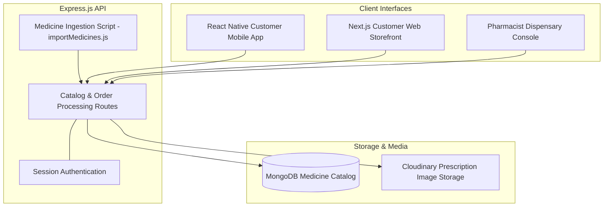

# Health Hands Pharmacy — Multi-Tier Retail & Prescription Platform

Systems architecture and engineering case study for the multi-tier digital pharmacy and prescription dispensing platform built for **Health Hands Pharmacy**.

---

## Role & Scope

* **Role:** Full-Stack Developer (Team Project)
* **Context:** Built under Softsols Pakistan for Health Hands Pharmacy.
* **Scope of Ownership:** Contributed across the 4-tier platform: engineered the medicine catalog ingestion script (`importMedicines.js`), built prescription upload endpoints, and structured the pharmacist review queue.

---

## System Flow

---

## Technical Highlights

* **Pharmaceutical Data Ingestion:** Built a Node.js ingestion script (`importMedicines.js`) parsing medicine spreadsheets into MongoDB, mapping brand names, formulas, dosage strengths, and prices.
* **Prescription Review Queue:** Structured a verification dashboard where pharmacy staff inspect uploaded prescription images, confirm doctor instructions, adjust order quantities, and mark items for delivery.
* **Prescription Uploads:** Handled customer prescription photo uploads routed directly to Cloudinary media storage.
* **Multi-Platform Access:** Connected both a Next.js web storefront and an Expo-based React Native mobile app to the shared Express backend.

---

## Tech Stack

* **Mobile:** React Native, Expo
* **Web:** Next.js, React, Tailwind CSS
* **Backend:** Node.js, Express.js REST API
* **Database:** MongoDB, Mongoose
* **Media Storage:** Cloudinary

---

## Notice

Commercial pharmaceutical datasets, customer contact records, and prescription images belong to Health Hands Pharmacy and Softsols Pakistan. This repository documents software architecture and application workflows.
